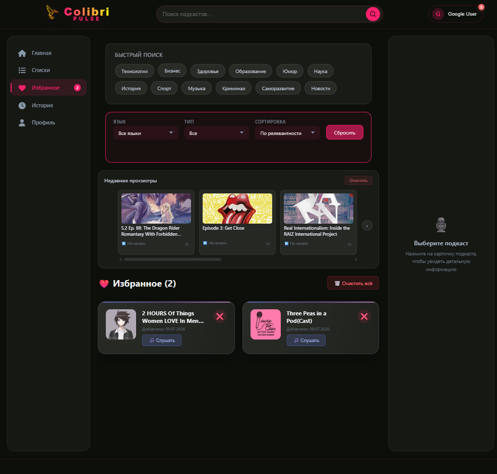
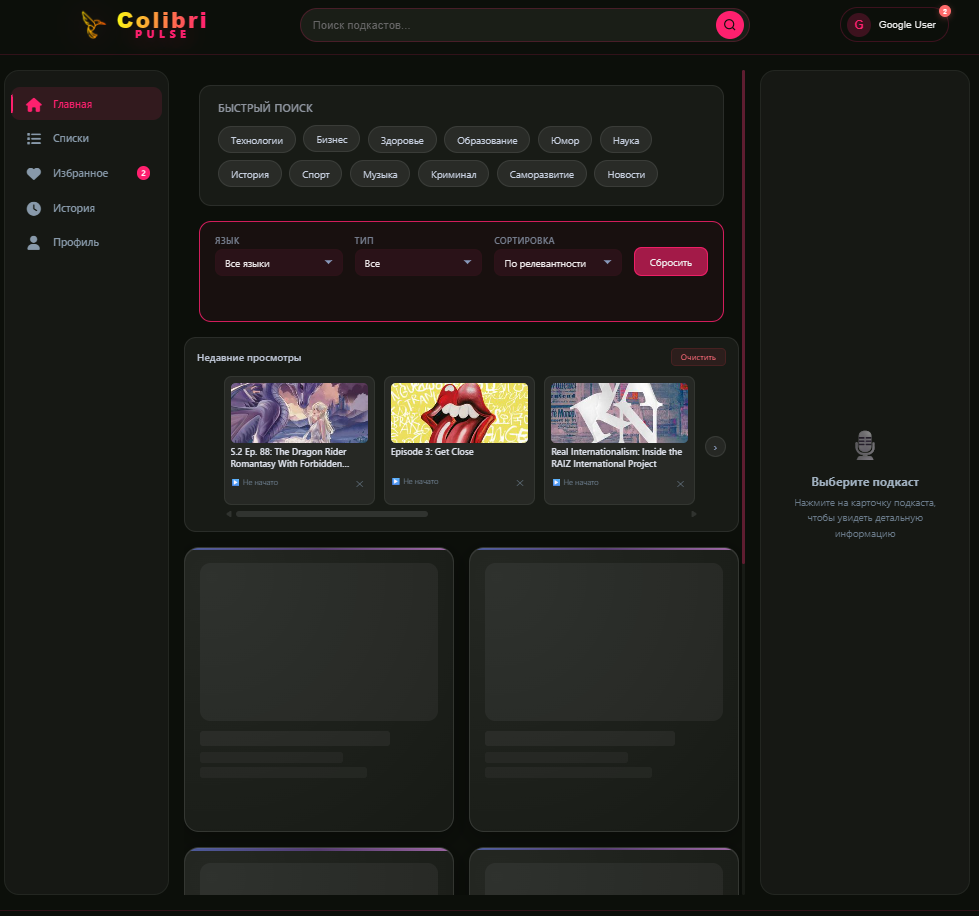

# Colibri Pulse - Podcast Player

Colibri Pulse is a web application for discovering, listening to, and managing podcasts.

## Core Features

## Демо
https://daryadudkova98.github.io/colibri-pulse-player/

### 🔍 Search & Filtering
- **Keyword search** — quick search for podcasts and episodes
- **Presets** — quick search queries for popular topics (Technology, Business, Science, Comedy, etc.)
- **Filters** — sorting by language, content type, date, and popularity
- **Active filters** — visual display of applied filters

### 📚 Podcast Management
- **Pagination** — convenient navigation through search results with page-by-page output
- **Recent views slider** — horizontal slider with listening history
- **Favorites** — add episodes to favorites with count display
- **Detailed information** — view full podcast information in the right info panel

### 🎵 Audio Player
- **Floating player** — compact player that remains visible while scrolling
- **Playback controls** — play/pause, seek, progress bar
- **Sync** — playback progress saved in viewing history
- **Minimize** — collapse the player into compact mode

### 👤 User Experience
- **Account login** — partial authorization implementation (Login page integration)
- **User profile** — avatar display and favorite episodes
- **Viewing history** — automatic saving of viewed episodes
- **Toast notifications** — informative pop-up messages about actions

## Technologies

* HTML5, CSS3, JavaScript
* Listen Notes API — for searching and retrieving podcast data
